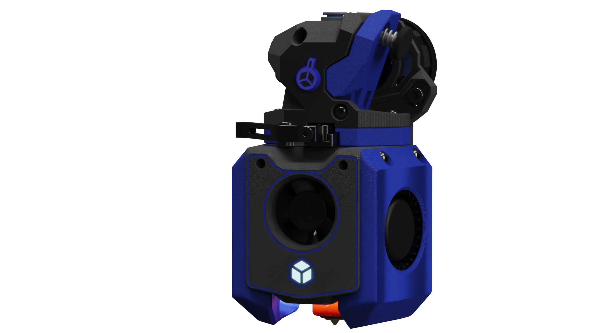

# A4Tv2: A new version of [A]nother [4]01x [T]oolhead

[![CC BY-NC-SA 4.0][cc-by-nc-sa-shield]][cc-by-nc-sa]

A4Tv2 is a new version of [A4T](https://github.com/DW-Tas/A4T), from:  [DW-Tas](https://github.com/DW-Tas)

> [!TIP]
> **A4Tv2 is a prerelease.** This design is still in development and should be treated as experimental. It is not a fully documented release.

## Documentation and assembly

There is currently no complete A4Tv2 documentation and no installation or assembly instructions. The CAD, STL, and 3MF files have been exported and are available to get started with.

## Files

- `CAD/` STEP files, including the A4Tv2 assembly STEP and ZIP exports.
- `STL/` exported STL files.
- `3MF/` exported 3MF files.

> [!WARNING]
>## UHF hotend screw warning
>
>The UHF versions, including Rapido X, use countersunk screws to hold the hotend to the main body. I am not yet certain this is a good .long-term fastening method. The wedge shape of the countersunk screw could put outward force on the printed plastic and cause it to creep or split over time. This is a potential risk, not a confirmed failure; treat these versions as experimental and inspect the printed part for cracking or deformation.

  
> [!TIP] 
> ### You can help support the development of this project. 
> Donate at https://ko-fi.com/dwtas 

  

This work is licensed under a
[Creative Commons Attribution-NonCommercial-ShareAlike 4.0 International License][cc-by-nc-sa].

[![CC BY-NC-SA 4.0][cc-by-nc-sa-image]][cc-by-nc-sa]

[cc-by-nc-sa]: http://creativecommons.org/licenses/by-nc-sa/4.0/
[cc-by-nc-sa-image]: https://licensebuttons.net/l/by-nc-sa/4.0/88x31.png
[cc-by-nc-sa-shield]: https://img.shields.io/badge/License-CC%20BY--NC--SA%204.0-lightgrey.svg

### License clarification regarding non-commercial use:
The non-commercial aspect of this license is for cases where A4Tv2 is the product, not the use of A4Tv2 to create products. 
I.e. If you wish to sell A4Tv2 as a product, you would need to seek a commercial license before doing so.  
It is NOT intended to prevent the use of A4Tv2 in a printer that you use to provide commercial services. If you want to run A4Tv2 as a toolhead for your print farm printers, go right ahead.